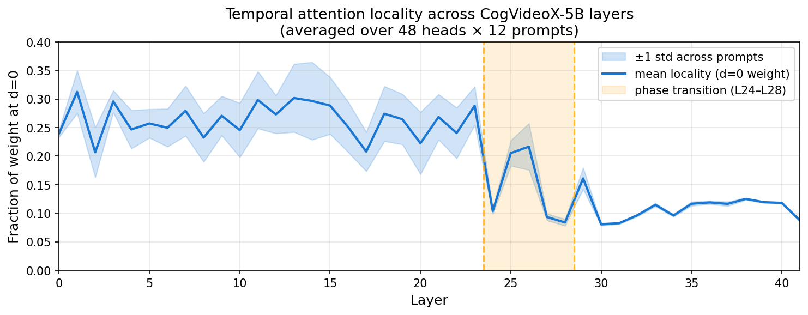
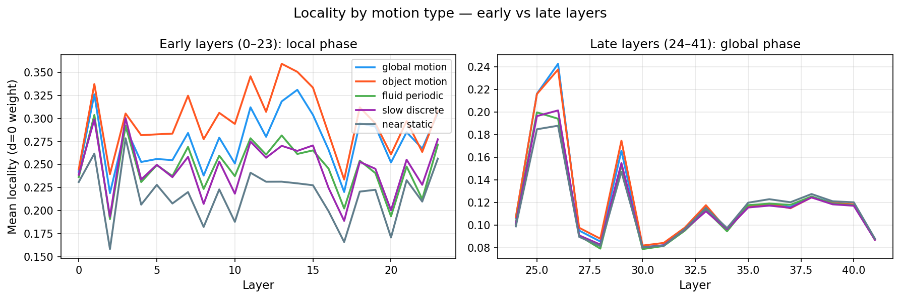
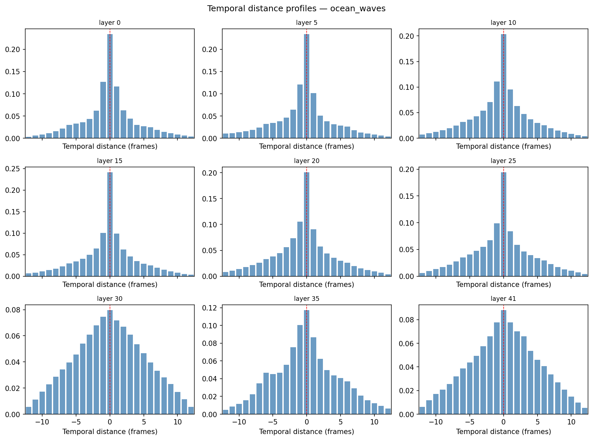
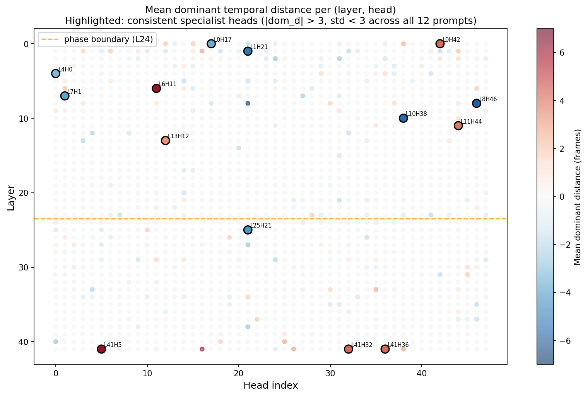
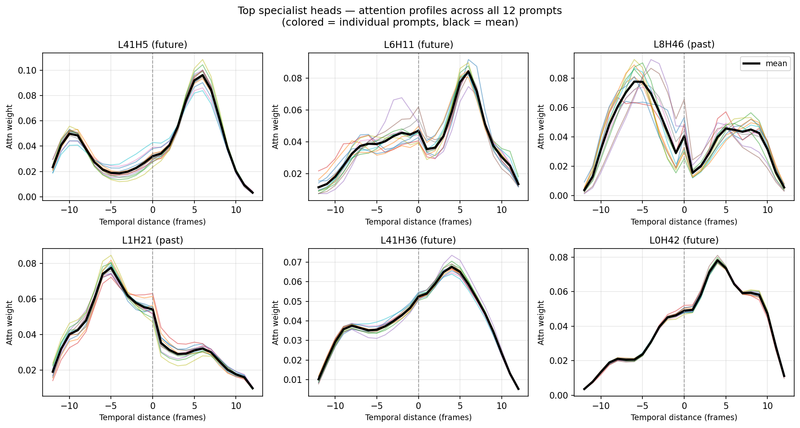
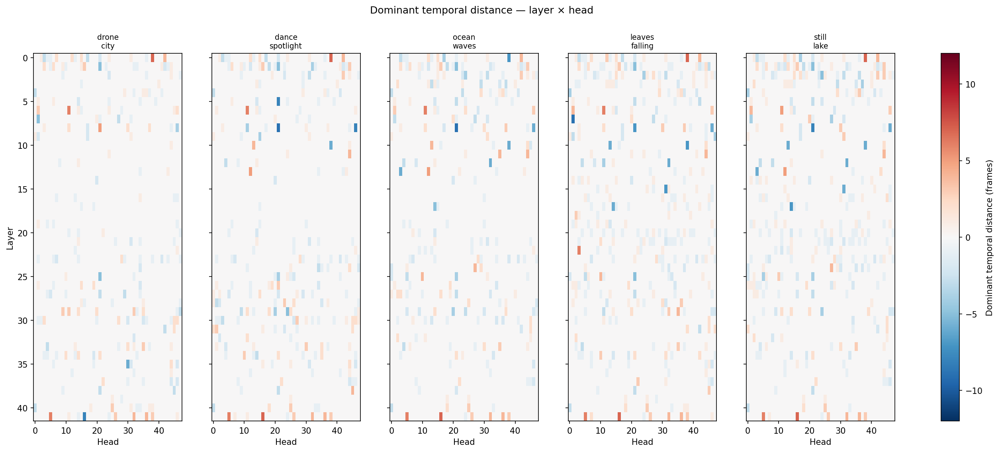

# Phase 1 — Temporal Attention Profiles: результаты

**Модель:** CogVideoX-5B  
**Дата:** 2026-05-31  
**Артефакты (raw):** `data/results/profiles/*.pt` (в DVC)  
**Графики:** `assets/phase1_profiles/`

---

## Постановка эксперимента

Для каждого из 12 промптов (5 групп движения) запускали forward pass CogVideoX-5B с хуками на `temporal_attn` во всех 42 блоках. Хук накапливал **temporal distance profile** — распределение весов внимания по расстоянию между фреймами Δt ∈ [−12, +12], усреднённое по spatial-токенам «на лету» (полную матрицу 70 200 × 70 200 не материализовали).

Результат на каждый промпт: словарь `{layer: Tensor[48, 25]}` — 42 слоя, 48 голов, 25 темпоральных расстояний.

### Промпты по группам

| Группа | Промпты |
|---|---|
| `global_motion` | drone_city, highway_drive, coast_pan |
| `object_motion` | walk_park, dance_spotlight, dog_fetch |
| `fluid_periodic` | ocean_waves, flag_wind, campfire_smoke |
| `slow_discrete` | leaves_falling, snowfall_street, candle_flame |
| `near_static` | still_lake |

---

## Находка 1 — Фазовый переход на слоях 24–28

В слоях 0–23 (~**локальная фаза**) доля веса на d=0 держится на уровне ~0.25 — модель смотрит преимущественно на текущий фрейм. На слоях 24–28 происходит резкий переход: локальность падает с 0.29 до 0.08 и в дальнейшем (слои 29–41) стабилизируется на ~0.10. Это **снижение в 2.5×** — качественная смена поведения в середине сети.

Примечательно, что переход очень резкий: за 4 слоя (24→28) локальность теряет ~60% своего значения. Разброс между промптами (±1 σ, голубая полоса) в поздней фазе почти нулевой — поведение стало универсальным.

---

## Находка 2 — Тип движения почти не влияет на агрегированные профили

В локальной фазе (слои 0–23) между группами есть расхождение до 3 пп: `object_motion` стабильно чуть более локален, `near_static` — чуть более глобален. Но это слабый сигнал. После перехода (правая панель) все пять групп сходятся в диапазон 0.08–0.12 с разбросом <0.5 пп.

**Вывод:** на уровне усреднённых по головам профилей CogVideoX не разделяет типы движения. Специализация (если она есть) должна быть на уровне отдельных голов.

---

## Находка 3 — Профили по слоям одного промпта

Для промпта `ocean_waves` видно как меняется форма профиля от слоя к слою. Ранние слои (0–15) — острый пик в нуле. Поздние слои (30–41) — широкий, почти плоский колокол. Слой 30 наиболее «широкий» по spread (5.21 фрейма против 4.00 у слоя 0).

---

## Находка 4 — Специализированные головы: редкие, но детерминированные

Для каждой (слой, голова) вычисляли **доминирующее темпоральное расстояние** — argmax профиля, усреднённый по 12 промптам. Большинство голов имеют dom_d ≈ 0 (серое поле). Но 14 голов стабильно нелокальны (|mean\_dom\_d| > 3, σ < 3 кадра):

| Голова | mean\_dom\_d | σ | Направление |
|---|---|---|---|
| **L41H5** | **+6.0** | **0.00** | будущее |
| **L6H11** | +5.9 | 0.27 | будущее |
| **L8H46** | −5.7 | 1.07 | прошлое |
| **L10H38** | −5.5 | 1.74 | прошлое |
| **L1H21** | **−5.0** | **0.00** | прошлое |
| L25H21 | −4.1 | 1.27 | прошлое |
| **L41H36** | **+4.0** | **0.00** | будущее |
| **L41H32** | **+4.0** | **0.00** | будущее |
| **L0H42** | **+4.0** | **0.00** | будущее |
| L11H44 | +3.8 | 1.12 | будущее |
| L0H17 | −3.5 | 0.50 | прошлое |
| L4H0 | −3.1 | 1.00 | прошлое |

Жирным выделены головы со **σ = 0** — их доминирующее расстояние буквально одинаково на всех 12 промптах. Эти головы не адаптируются к контенту вообще; они «зашиты» как структурные компоненты сети.

Профили специалистов — не импульсы, а широкие пики, смещённые на 4–6 кадров от нуля. L41H5 всегда пикует в +6, L1H21 — в −5, независимо от содержания видео.

---

## Находка 5 — Доминирующие расстояния по всем промптам (heatmap)

На heatmap видно: паттерн **структурно стабилен** между промптами (одни и те же пятна на одних и тех же позициях), но отдельные головы дают разные значения в зависимости от видео. Это подтверждает: большинство голов контент-зависимы, специалисты (σ=0) — нет.

---

## Сводка числовых результатов

| Метрика | Локальная фаза (L0–23) | Глобальная фаза (L24–41) |
|---|---|---|
| Локальность (d=0, mean) | 0.262 | 0.104 |
| Spread (weighted σ) | ~4.0 фр. | ~5.2 фр. |
| Разброс между группами движения | ≤3 пп | ≤0.5 пп |
| Специалистов (|dom\_d|>3, σ<3) | 10 из 1152 | 4 из 864 |

---

## Гипотезы для Phase 2 (аблация)

На основе профилей выдвигаем следующие гипотезы (в порядке убывания приоритета):

1. **Удаление L41H5** не должно сильно влиять на `temporal_consistency` (голова смотрит в будущее относительно текущего запроса, но в inference будущих кадров ещё нет — интересно что именно она кодирует)
2. **Удаление L1H21 + L8H46** (смотрящие в прошлое, σ=0) должно сломать короткодистанционную когерентность в начале сети
3. **Нулевание всех голов в L30–L41** должно сильнее всего снизить `temporal_consistency` (поздняя глобальная фаза)
4. **Нулевание L24–L28** (зона перехода) — ожидаем максимальный эффект на `motion_score`

Целевые метрики: `motion_score` (оптический поток Farneback) + `temporal_consistency` (CLIP cosine между соседними кадрами).
