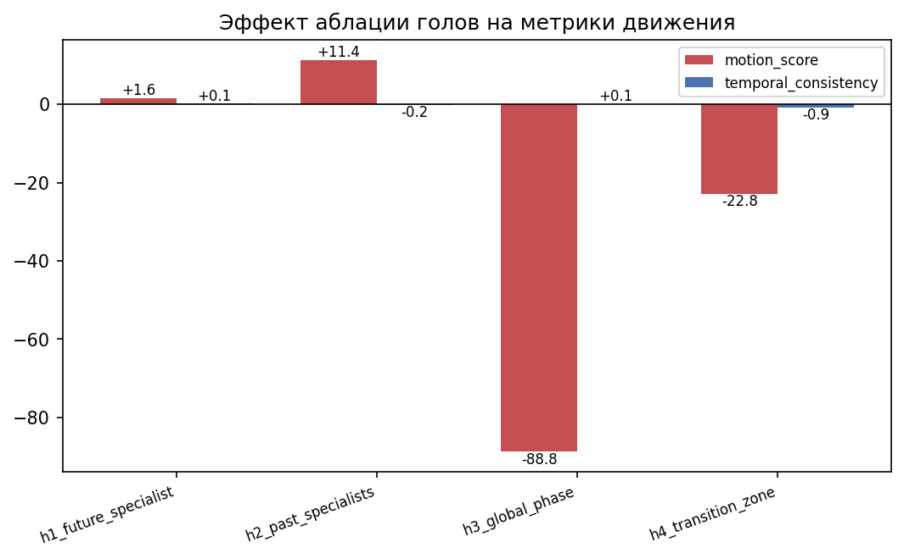

# Phase 3 — Хирургическая аблация голов temporal attention: результаты

**Модель:** CogVideoX-5B
**Дата:** 2026-06-05
**Артефакты (raw):** `data/results/ablation/{metrics.json, ablation_table.md, ablation_deltas.png, videos/}` (в DVC)
**Опирается на:** `reports/phase1_profiles.md` (профили и 4 гипотезы)

---

## Постановка эксперимента

Из профилей Phase 1 выдвинули 4 гипотезы о роли разных голов/слоёв temporal
attention. Каждую проверяли **хирургической аблацией**: зануляли столбцы
`attn1.to_out`, отвечающие за слайс целевых голов (Q/K/V и кэш не трогаются), и
сравнивали `baseline` vs `ablated` на одних и тех же 10 промптах.

**Парный дизайн:** один и тот же seed на промпт для baseline и ablated, поэтому
единственное отличие между двумя видео — сама аблация (низкодисперсные дельты).

**Метрики:**

- `motion_score` — средняя L2-норма оптического потока Farneback между соседними
  кадрами. *Сколько* движения.
- `temporal_consistency` — средний cosine между CLIP-эмбеддингами соседних кадров.
  *Насколько связно* (соседние кадры — одна сцена, без мерцания/кипения).
  ⚠️ Вырождается: замёрзшее видео даёт consistency ≈ 1.0 «бесплатно», поэтому
  **читается только в паре с motion_score**.

Бейзлайн (среднее по 10 промптам): **motion = 4.765**, **consistency = 0.9743**.

---

## Предсказание → факт

| Гипотеза | Занулено | Предсказание (Phase 1) | Δ motion | Δ consist | Итог |
|---|---|---|---|---|---|
| **h1** future_specialist | L41H5 — **1 голова** | слабый эффект на consistency | +1.6% | +0.1% | ✓ нулевой эффект (контроль) |
| **h2** past_specialists | L1H21+L8H46 — **2 головы** | сломает ближнюю когерентность | **+11.4%** | −0.2% | ✗ когерентность цела, motion вырос |
| **h3** global_phase | L30–41 — **576 голов** | макс. падение consistency | **−88.8%** | +0.1% | ✗✗ перевернулась |
| **h4** transition_zone | L24–28 — **240 голов** | макс. эффект на motion | **−22.8%** | **−0.9%** | ~ motion упал, но это макс. удар по consistency |

Ни одно предсказание не сбылось «как написано»; h3 и h4 перевернулись. Это
содержательный результат: метрики реагируют, и эффекты структурированы. На графике
красные столбцы — Δ motion_score, синие — Δ temporal_consistency (оба в %).

---

## Находка 1 — Одна голова ничего не решает (контроль)

Аблация специалиста **L41H5** (σ=0, dom_d=+6, «зашитая» голова из Находки 4
Phase 1) сдвигает метрики в пределах 4-го знака (motion +1.6%, consistency +0.1%),
и весь сдвиг — на одном промпте (p6 ocean_waves, 0.10→0.24, абсолютно мизер).

**Вывод:** удаление 1 из 2016 голов temporal attention неотличимо от шума. Это
ключевой **контроль** — он доказывает, что крупные эффекты h3/h4 не артефакт
«модель ломается от любого тычка», а реакция именно на масштаб/локацию резекции.
Роль отдельного специалиста либо избыточна (дублируется другими головами), либо
слишком тонка для агрегированных Farneback/CLIP-метрик.

---

## Находка 2 — «Прошлые» головы — это демпферы движения, а не когерентность

Удаление двух смотрящих в прошлое специалистов (L1H21, L8H46) **не сломало
когерентность** (−0.2% = шум), но **подняло motion на +11.4%**, причём
избирательно — там, где сильное камера-движение:

| промпт | motion baseline → ablated |
|---|---|
| p1 highway_drive | 15.48 → **19.42 (+25%)** |
| p0 drone_city | 5.53 → 6.57 |
| p8 campfire_smoke | 4.04 → 4.66 |
| p6 ocean_waves | 0.10 → 0.0006 (замёрзло) |

**Вывод:** головы с отрицательным dom_d (внимание в прошлые кадры) работают как
**инерция/демпфер** — подмешивают предыдущие кадры и сглаживают поток. Убираешь
демпфер → соседние кадры сильнее отличаются → выше оптический поток. Исходное имя
«past specialists / ближняя когерентность» вводит в заблуждение; правильнее —
**motion-damping heads**.

---

## Находка 3 — Поздняя фаза L30–41 — это двигатель движения (главный результат)

Предсказывали максимальное падение consistency. Получили **consistency +0.1%
(не упал)** при **обвале motion на −88.8%**. В сырых данных — почти равномерный
коллапс к нулю по всем промптам; крайний случай p6 ocean_waves: motion **0.0**,
consistency ровно **1.0** (буквально замёрзший клип). Частично уцелел только
p7 flag_wind (3.40 → 2.12).

**Вывод:** поздняя «глобальная» фаза (L30–41) **синтезирует само движение**, а не
хранит когерентность. Зануляешь её → видео замерзает. Consistency при этом не упал
**именно потому, что** видео замёрзло: идентичные кадры → cosine ≈ 1. Это
одновременно и **демонстрация вырожденности метрики consistency** — её нельзя
интерпретировать без motion.

⚠️ **Оговорка о масштабе.** Здесь занулено **576 голов = 12 из 42 слоёв (28.6%
всего temporal attention)**. Это резекция доли, а не хирургия. Корректная
формулировка: «поздние слои критичны для генерации движения». *Какие именно
головы* отвечают за это — h3 не изолирует (см. «Ограничения»).

---

## Находка 4 — Зона перехода L24–28 собирает когерентность

Motion −22.8%, и это **единственная гипотеза с заметным падением consistency
(−0.9%, худшее из четырёх)**. Среднее обманчиво — механизм виден только в сырых
данных: это не равномерное «меньше движения», а **сломанное движение**.

| промпт | motion baseline → ablated | что произошло |
|---|---|---|
| p1 highway_drive | 15.48 → **1.93** | связный пролёт камеры раздавлен |
| p5 dog_fetch | 10.75 → 10.80 | не тронут |
| p6 ocean_waves | 0.10 → **2.27 (×22)** | в статичную сцену впрыснут джиттер |
| p0 drone_city | 5.53 → 6.48 | вырос |

Падение consistency распределённое (p3 walk_park, p5 dog_fetch, p8 campfire,
p9 leaves) — деградация реальная, а не вырожденная.

**Вывод:** L24–28 — **зона сборки когерентности**. Это та же зона, где в Phase 1
(Находка 1) локальность падает в 2.5×. Разрушаешь переход → модель теряет
способность организовать *связное глобальное* движение (highway-пролёт распадается)
и вместо этого генерит *локальную нестабильность* (статичная вода начинает
дрожать). Отсюда и худший удар именно по consistency.

---

## Сквозная картина: две стадии

Аблации складываются в двухстадийную механику temporal attention, которая ровно
ложится на фазовый переход из Phase 1:

| Слои | Роль | Эффект аблации |
|---|---|---|
| **L24–28** (зона перехода) | сборка **когерентности** | consistency −0.9%, связное движение ломается (h4) |
| **L30–41** (поздняя глобальная фаза) | синтез **самого движения** | motion −89%, видео замерзает, но остаётся когерентным (h3) |

Когерентность собирается в зоне перехода; величина движения производится позже.

---

## Ограничения (честно)

1. **Размерный confound.** h1/h2 — это 1–2 головы, h3/h4 — 240–576 голов.
   Сравнивать их Δ% «в лоб» нельзя: это смешивает «важность региона» с «важностью
   на голову». h3 бьёт сильнее h4 во многом потому, что занулил в 2.4× больше слоёв.
2. **Нет random-layer контроля.** Без аблации случайных 576/240 голов h3 строго
   говорит лишь «28% внимания — несущие», а не «именно поздняя фаза особенная».
   Это главный недостающий контроль.
3. **Регионы не разложены на головы.** Раз L30–41 и L24–28 критичны целиком —
   нужно спуститься внутрь (слой → голова), чтобы найти конкретных «виновников».
4. **n=10, без парной статистики.** Дизайн парный (один seed), но значимость
   per-prompt дельт не считалась. h1 (+1.6%) и h2-consistency (−0.2%)
   статистически неотличимы от нуля; h4-consistency, вероятно, значим — это надо
   подтвердить sign-test / paired-t.

---

## Что дальше

- **Random-layer контроль** для h3/h4 (закрыть ограничение 2) — приоритет 1.
- **Спуск внутрь L30–41**: послойная, затем поголовная аблация — найти двигатель
  движения точечно.
- **Парная статистика** по сохранённым per-prompt дельтам из `metrics.json`.
